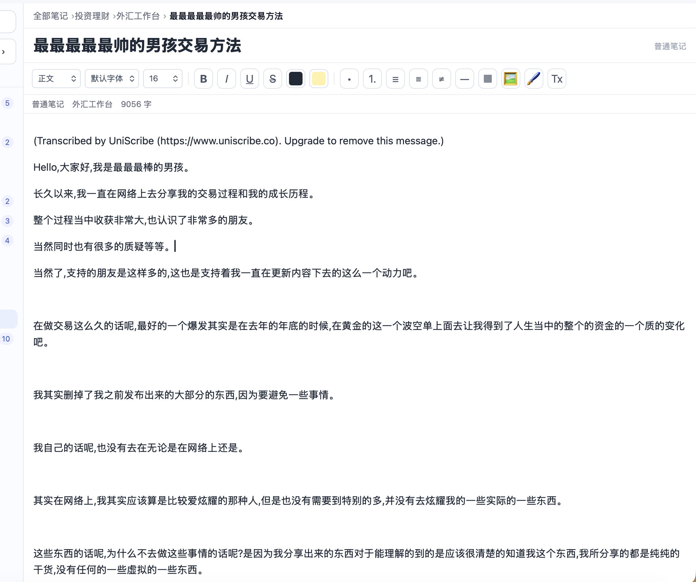
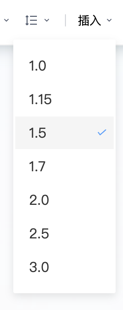
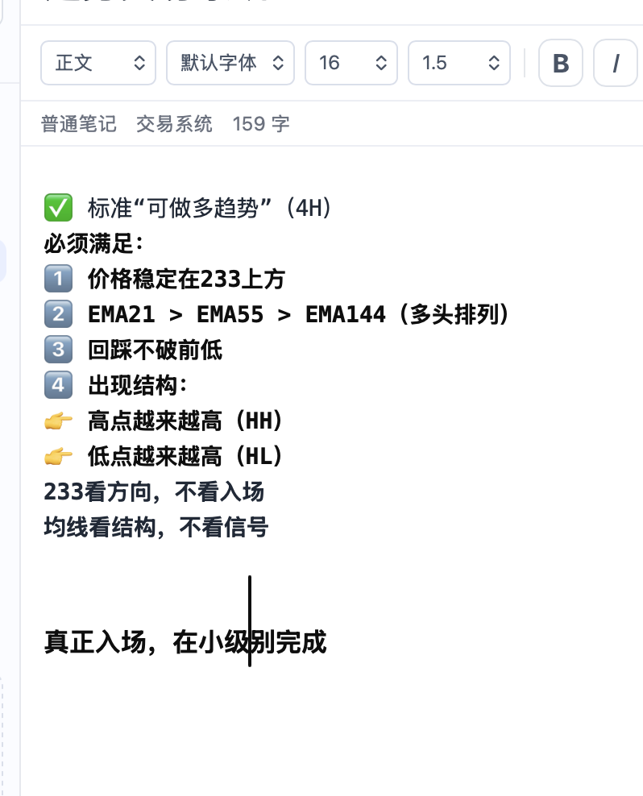
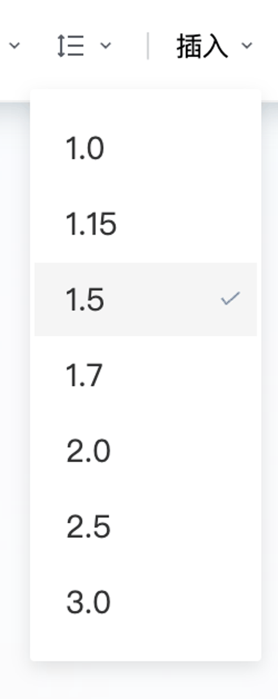

# 海猫笔记 · Seacat Note


一款**本地优先、安全、偏专业工作流**的桌面笔记应用，使用 **Tauri 2 + Rust + React + TypeScript** 构建。  
它面向希望把**普通笔记、富文本、Markdown、思维导图、保险箱敏感信息**放到同一套桌面工作流里的用户。

---

## 为什么做这个项目

Seacat Note 的目标不是“再做一个在线云笔记”，而是提供一套更偏**本地、私密、可控、桌面化**的记录体验：

- 普通笔记与富文本编辑共存
- 敏感内容放进独立的保险箱
- 思维导图适合整理结构化想法
- 数据本地存储，界面响应轻快
- 更适合个人研究、交易复盘、知识整理、账号信息管理

---

## 核心特性

### 1. 富文本编辑器
- 字体、字号、颜色、背景色
- 加粗、斜体、下划线、删除线
- 行距调整
- 表格插入 / 删除行列
- 图片插入与图片大小快捷调整
- 右键菜单与格式刷

### 2. 多笔记类型
- 富文本笔记
- Markdown 笔记
- 思维导图笔记

### 3. 保险箱（Vault）
- 与普通笔记分区管理
- 适合保存账号、密码、助记信息、安全备注
- 独立解锁流程
- 更适合高敏感内容的本地管理

### 4. 本地优先
- Rust 后端
- SQLite 本地存储
- Tauri 桌面端封装
- 更轻、更快、更适合长期本地使用

---

## 项目预览

### 编辑器界面


### 行距调整


### 字号 / 光标问题修复后的编辑体验


### 简短演示动图


---

## 本次终版补丁说明

这次版本额外修了几个编辑器里最影响体验的问题：

- 修复了**最小字号选择后反而变得很大**的问题
- 修复了**最后一行难以正确应用字号**的问题
- 修复了**最后一行在改字号后，光标跳回第一行**的问题
- 修复了**最后一行光标异常变大**的问题
- 富文本与保险箱富文本的工具栏保持一致
- 加入了行距下拉选项
- 对齐了 `Cargo.toml` 与 `package.json` 的 Tauri 版本组合

---

## 技术栈

### 前端
- React
- TypeScript
- Vite

### 桌面层
- Tauri 2

### 后端 / 本地能力
- Rust
- SQLite (`rusqlite`)

### 图谱能力
- simple-mind-map

---

## 项目结构

```text
.
├── src/                 # React 前端
├── src-tauri/           # Rust / Tauri
├── branding/            # 图标与品牌资源
├── docs/assets/         # README 展示图与动图
├── package.json
├── vite.config.ts
└── README.md
```

---

## 本地开发

### 1. 安装依赖
```bash
npm install
```

### 2. 启动开发模式
```bash
cargo tauri dev
```

### 3. 构建桌面包
```bash
cargo tauri build
```

---

## 当前推荐的 Tauri 版本组合

为了避免 `tauri` / `tauri-build` / `@tauri-apps/api` 之间的版本错配，这个仓库当前使用的是：

### package.json
- `@tauri-apps/api`: `2.8.0`
- `@tauri-apps/plugin-dialog`: `2.4.0`
- `@tauri-apps/cli`: `2.8.0`

### Cargo.toml
- `tauri-build`: `2.5.6`
- `tauri`: `2.8.5`
- `tauri-plugin-dialog`: `2.4.0`

如果你本地之前装过别的版本，建议先清理一次：

```bash
rm -rf node_modules package-lock.json
cd src-tauri
rm -f Cargo.lock
cd ..
npm install
cargo update
cargo tauri build
```

---

## GitHub 上传建议

首次推到 GitHub：

```bash
rm -rf .git
git init
git add .
git commit -m "feat: release Seacat Note"
git branch -M main
git remote add origin https://github.com/你的用户名/你的仓库名.git
git push -u origin main
```

如果你之前误把 `node_modules` 或 `target` 提交过：

```bash
git rm -r --cached .
git add .
git commit -m "chore: clean repository"
git push -f origin main
```

---

## Roadmap

- 更成熟的富文本工具栏状态回显
- 更完整的编辑器样式体系
- 更稳的图片 / 表格操作体验
- 更强的保险箱交互
- 更统一的主题与视觉系统
- 发布自动化（GitHub Release / DMG / Windows）

---

## License

本项目采用 [MIT License](LICENSE)。
