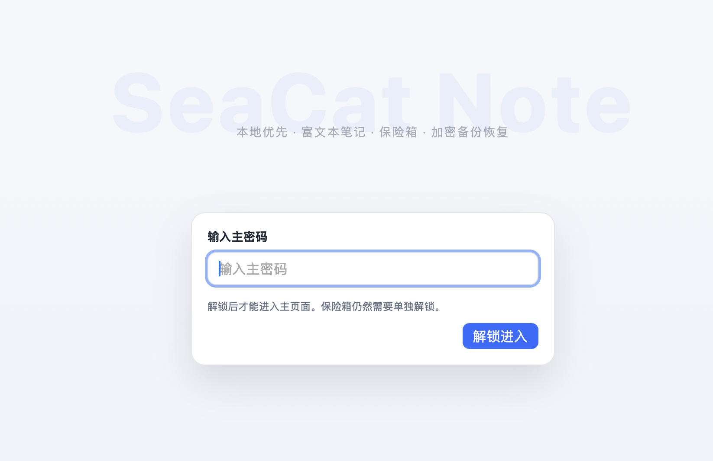

# 🐱 Seacat Note（海猫笔记）

> 本地优先 · 富文本 · 加密保险箱 · 自动备份  
> ⚡ 一个轻量但强大的桌面笔记工具


---

## 🚀 下载（直接使用）

👉 最新版本：
https://github.com/seacat1024/seacat-note/releases

- 🖥 Windows：下载安装包（.exe）
- 🍎 macOS：下载安装包（.dmg）

---

## 📸 界面预览

### 登录


### 主工作台


### 笔记编辑


### 备份 / 恢复


---

## ✨ 功能特点

### 🧾 富文本编辑
- 字号 / 行距控制
- 基础排版能力
- 轻量但实用

### 🔐 保险箱
- 独立密码保护
- 敏感信息存储
- 本地安全

### 💾 加密备份
- 一键导出
- 密码加密
- 支持恢复

### ⚡ 本地优先
- SQLite 本地存储
- 无账号 / 无云依赖
- 数据完全可控

---

## ⚙️ 技术栈

- Rust
- Tauri 2
- React + TypeScript
- SQLite

---

## 🚀 开发

```bash
npm install
cargo tauri dev
```

---

## 🔄 自动构建

- GitHub Actions 自动构建
- 支持 Windows + macOS
- 打 tag 自动生成版本

```bash
git tag v1.0.0
git push origin v1.0.0
```

---

## 🤖 说明

本程序全来自 ChatGPT 编写。

---

## ⭐ 支持

如果你觉得有用，点个 Star ⭐
